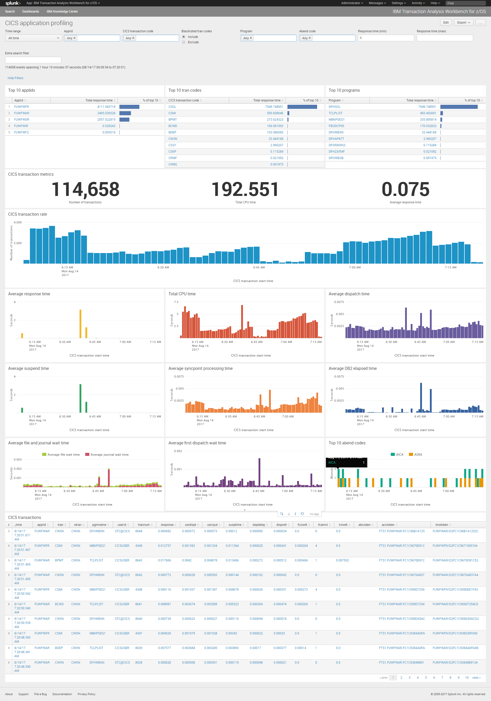
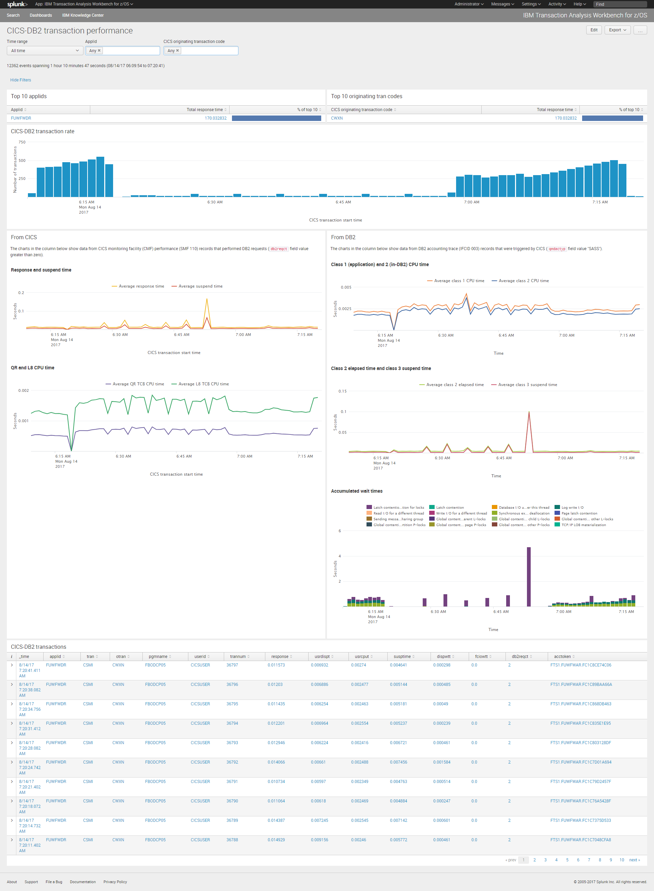
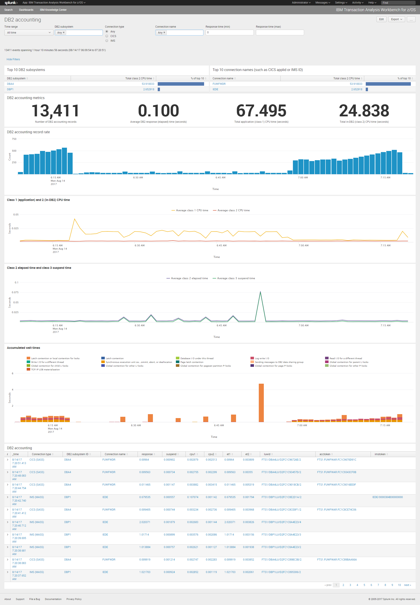
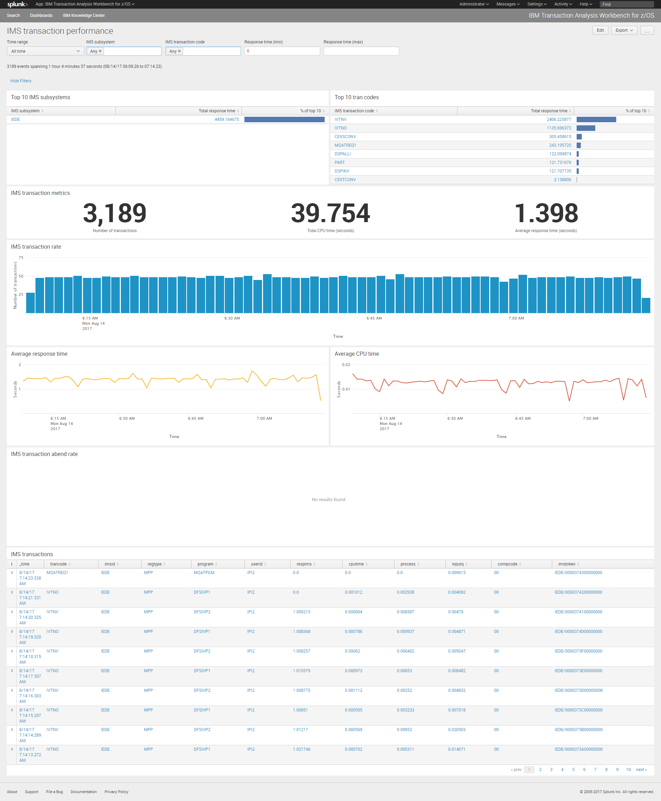
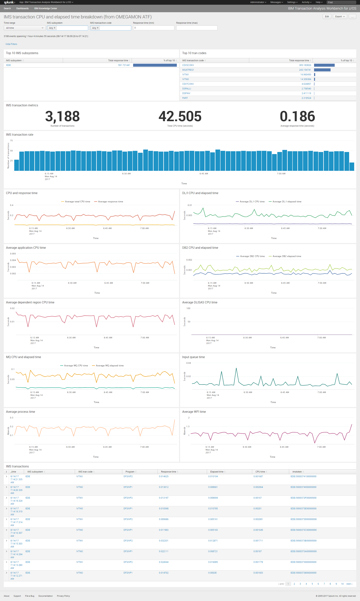
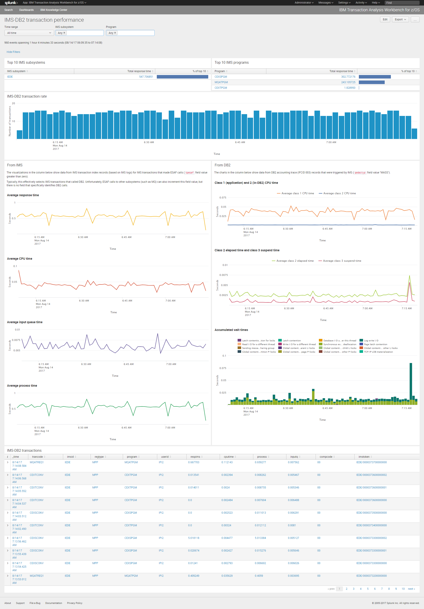

# IBM Transaction Analysis Workbench for z/OS: Splunk app containing sample dashboards

This repository contains a [Splunk](http://www.splunk.com) app
for [IBM Transaction Analysis Workbench for z/OS](https://www.ibm.com/marketplace/transaction-analysis-workbench-for-z)
(colloquially known as Workbench or TAW).

The app contains sample dashboards that present various types of z/OS-based log data forwarded by Workbench.

For an introduction to the sample dashboards, watch the YouTube video "[IBM Transaction Analysis Workbench for z/OS - Operations analytics dashboards in Splunk and Elastic](https://youtu.be/0Z30BxEqzJ8)".

If you want to try the app without installing Splunk or Workbench, you can download a Docker image containing Splunk, the app, and sample data (all preconfigured, ready to run) from [Docker Hub](https://hub.docker.com/r/fundisoftware/taw-splunk/).

## Requirements

To use the app, you will need:

* Splunk 6.6.3, or later

To forward logs from z/OS to Splunk:

* IBM Transaction Analysis Workbench for z/OS, V1.3, at the PTF level for [APAR PI82316](http://www.ibm.com/support/docview.wss?&uid=swg1PI82316)

## Installation

This Git repository *is* the Splunk `taw` app.

To install the app, clone this Git repository to a new `taw` subdirectory under `Splunk/etc/apps` in your Splunk installation.

After cloning, check that the directory structure contains the following path:

`Splunk/etc/apps/taw/local`

There should be no intervening directory between `taw` and `local`.

## Using Workbench to forward logs to Splunk

See the [example JCL](https://fundisoftware.github.io/taw-sample-dashboards-jcl).

## Splunk configuration files

The app includes the following Splunk configuration files that define a Splunk TCP data input for use with the example JCL:

* `inputs.conf`

  Defines a TCP data input, including the port number on which Splunk listens for incoming data. Sets the default sourcetype for data received via this input, and the default index, to `fuw`.

* `props.conf`

  Defines the incoming data as JSON Lines; configures timestamp recognition; refers to a per-event sourcetype override defined in `transforms.conf`.

* `transforms.conf`

  Contains stanzas to:
  - Set the `sourcetype` of each event to the value of the event `type` field.
  - Not used: Route each event to an index based on the `type` field.

## Setting which indexes the app searches

By default, the app (more specifically, *each of the search commands in the app*) searches for data in an index named `fuw`.

It's easy to change which index, or indexes, the app searches.
Rather than specifying index names directly in search commands, which would mean you would have to search and replace many index names in definitions across multiple files, the app uses macros.

The macros are defined in the file `local/macros.conf`.

## Definitions are supplied in the `local` directory, not `default`

This Git repository is a verbatim copy of the directory where we develop the app. We have deliberately not moved the app definition files, such as the dashboards, from the `local` directory, where they are developed, to the `default` directory. Keeping the definitions in `local` makes it easier for you to diff your copy with the GitHub repo.

When you deploy the app (very likely, with your own customizations) at your own site, you might consider moving your definitions from `local` to `default`, depending on your own site practices. For details, see the Splunk docs.

## Screenshots

### CICS application profiling dashboard

### CICS-Db2 transaction performance dashboard

### Db2 accounting dashboard

### IMS transaction performance dashboard

### IMS transaction CPU and elapsed time breakdown (from OMEGAMON ATF) dashboard

### IMS-Db2 transaction performance dashboard

## Who we are

[Fundi Software](http://www.fundi.com/) develops Workbench.